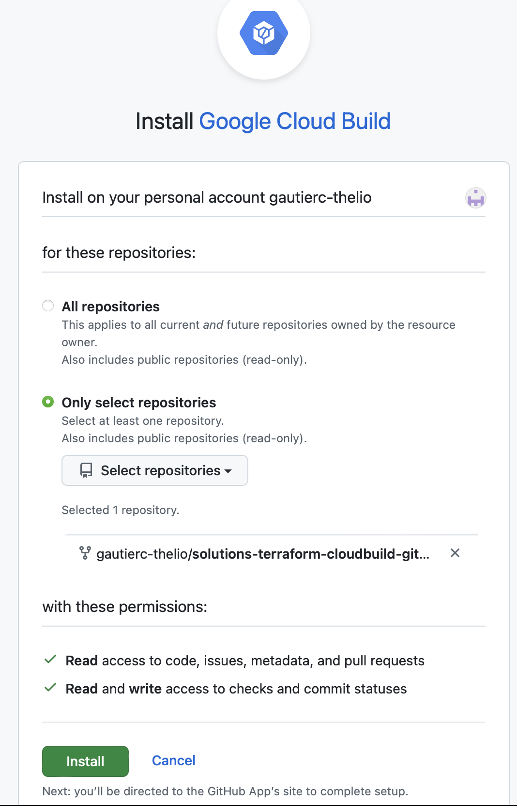
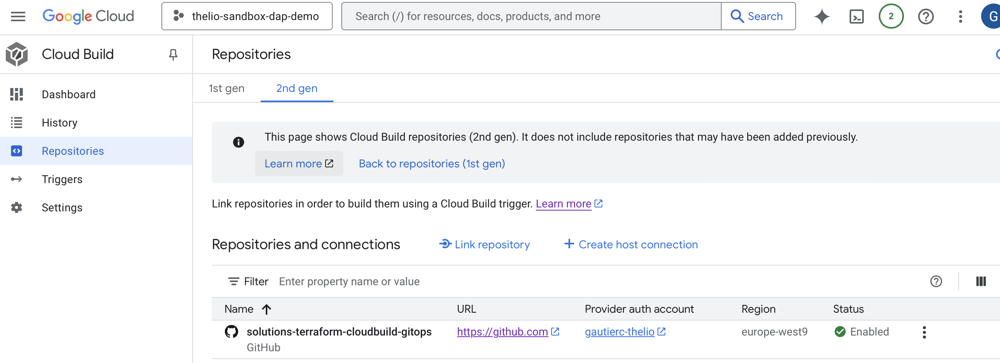

# Setup local environment
- Install [Terraform installation steps](https://developer.hashicorp.com/terraform/tutorials/docker-get-started/install-cli#install-terraform).
- Install [Docker](https://docs.docker.com/get-started/introduction/get-docker-desktop/).


# Setup GCP project

Create a GCP project with billing enabled

Follow the [setup steps ](https://cloud.google.com/docs/terraform/resource-management/managing-infrastructure-as-code#prerequisites)

Clone git repo with template terraform modules
```bash
git clone https://github.com/gautierc-thelio/solutions-terraform-cloudbuild-gitops.git
```

Create the bucket for terraform backend

```bash
gsutil mb -c standard -l europe-west9 gs://${PROJECT_ID}-tfstate
```

Enable object versioning
```bash
gcloud storage buckets update gs://${PROJECT_ID}-tfstate --versioning
```

Enable Cloud Build API in console
```bash 
gcloud services enable cloudbuild.googleapis.com
```
Enable Secret Manager API in console
```bash 
gcloud services enable secretmanager.googleapis.com
```
Enable Compute Engine API
```bash 
gcloud services enable compute.googleapis.com
```

Retieve dafault service account for cloud build
```bash
CLOUDBUILD_SA="service-$(gcloud projects describe $PROJECT_ID \
    --format 'value(projectNumber)')@gcp-sa-cloudbuild.iam.gserviceaccount.com"
```

Grant Project Editor Role (not recommended for production) and logWriter role.
```bash
gcloud projects add-iam-policy-binding $PROJECT_ID \           
    --member serviceAccount:$CLOUDBUILD_SA --roles roles/editor --condition None
```

Retieve default Compute service account used for cloud build and provide the required roles to write logs and 
```bash
COMPUTE_SA="$(gcloud projects describe $PROJECT_ID \
    --format 'value(projectNumber)')-compute@developer.gserviceaccount.com"

gcloud projects add-iam-policy-binding $PROJECT_ID --member serviceAccount:$COMPUTE_SA --role roles/logging.logWriter --condition None

gcloud projects add-iam-policy-binding $PROJECT_ID --member serviceAccount:$COMPUTE_SA --role roles/storage.objectUser --condition None

gcloud projects add-iam-policy-binding $PROJECT_ID --member serviceAccount:$COMPUTE_SA --role roles/compute.networkAdmin --condition None
```


Connect cloud build to Git Hub repository


Follow the instructions to connect to GitHub. 
  - Don't use your personnal account unless for dev/demo
  - Depending of the selected region, you may reach IAM Quota limits. Choose europe-west1 or request for a quota update.


Authorize the service account to run Cloud Build 
[Authorize service account](https://console.cloud.google.com/cloud-build/settings/service-account?hl=fr&invt=Abk9_g&inv=1&project=thelio-sandbox-dap-demo)

# Créer une nouvelle branche feature
Poursuivre les étapes de la [documentation](https://cloud.google.com/docs/terraform/resource-management/managing-infrastructure-as-code#changing_your_environment_configuration_in_a_new_feature_branch)